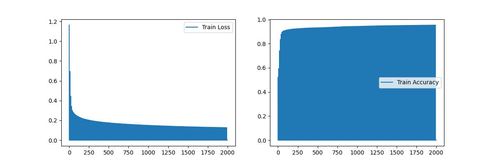
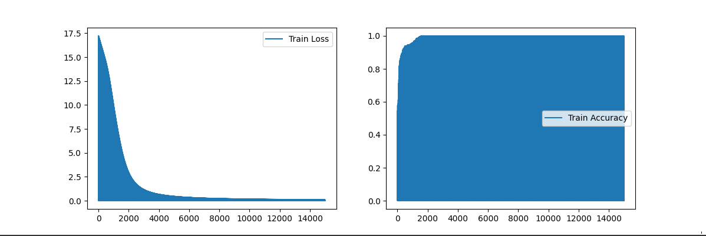

Simple Neural Network
===================

Neural network implementation for learning purpose

- Including : 
    - Neural activation
    - Loss calculating
    - Forward activation propagation
    - Backward adjustement propagation
    - Predictions

Single Layer Model
---------------

A neuron on a layer to be able to understand the general functioning of a neural network.



```
X_train, y_train = Datasets.get_random_blobs_set(n_samples=10000)
X_test, y_test = Datasets.get_random_blobs_set(n_samples=200)

model = SingleLayerNeuralModel(X_train, y_train)
model.start_training(iteration=2000, learning_rate=0.05)
model.show_training_results()
preds = model.predict(X_test)
```


Multi Layer Model
--------------

Neural network on several layers to improve the accuracy of the predictions and general abilities of the model.




```
X_train, y_train = Datasets.get_random_circles_set(n_samples=1000)
X_test, y_test = Datasets.get_random_circles_set(n_samples=200)

# hidden_layers determinates the number of layers and neurons
model = MultiLayerNeuralModel(X_train, y_train, hidden_layers=(16, 16, 16))
model.start_training(iteration=10000, learning_rate=0.05)
model.show_training_results()
preds = model.predict(X_test)
```

Install Requirements
----------

Created with python 3.10.6

```
python -m pip install -r requirements.txt
```